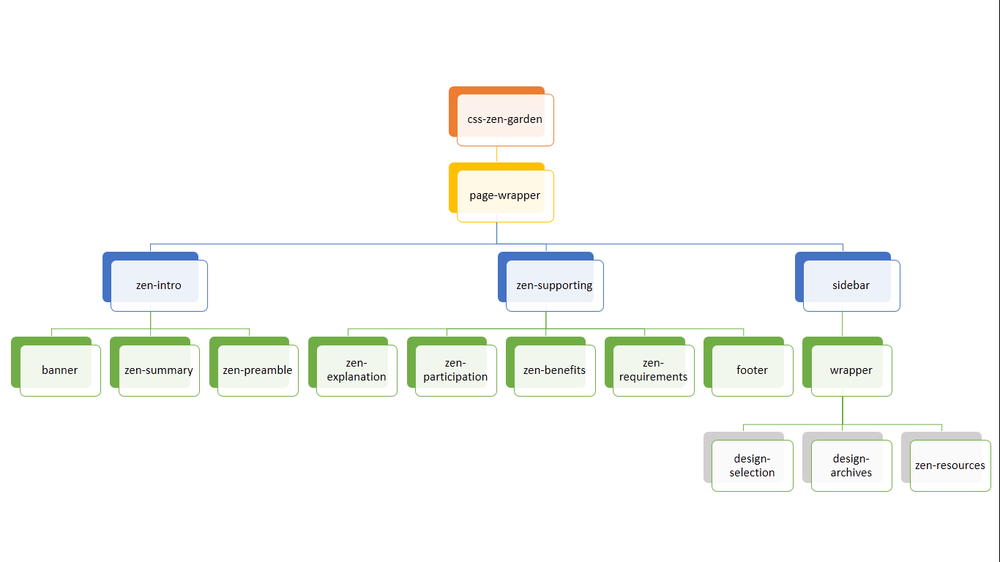
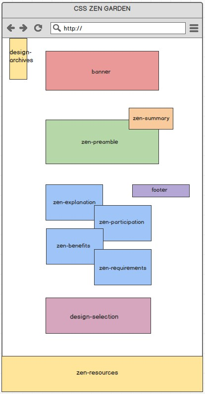
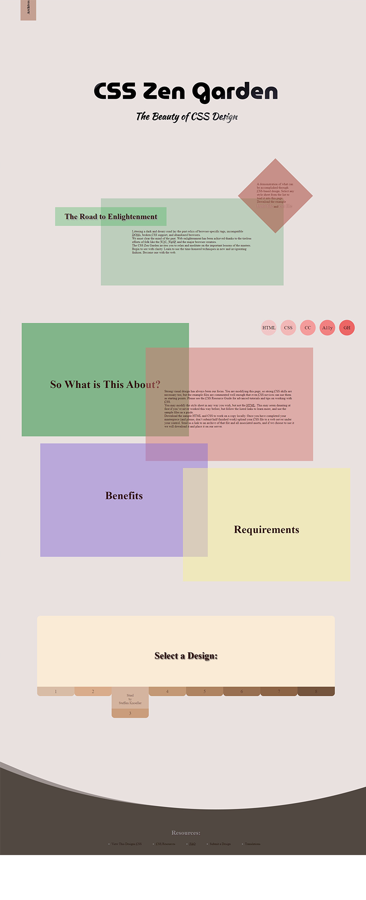

# CSS ZEN GARDEN 切版作業
- 為 CSS Zen Garden 設計一個主題風格頁面。
- 版型不限制尺寸大小，保留 index.html 裡面的原始結構、內容。
- 畫出 index.html 的id 區塊樹狀圖結構，可手繪（繳圖片）。
- 依照id 區塊樹狀結構，繪出版型草圖，可手繪（繳圖片）。
- 版面最後完成圖，影像處理軟體完成的圖片。（繳圖片，不用原始檔）。
- 相關檔案須放在對應目錄，css,js。
###### 連結網址
https://d559alice.github.io/css-zen-garden-d559alice/
### ID樹狀圖

### 排版草圖

### 網站呈現
